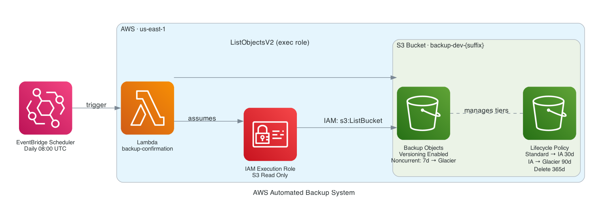

# AWS Automated Backup System

[](https://github.com/jordann6/aws-backup-system/actions/workflows/security-gate.yml)

Terraform-managed AWS infrastructure that provisions an S3 backup bucket with automated daily verification via Lambda and EventBridge Scheduler. Uses IAM execution roles for keyless authentication, S3 versioning for point-in-time recovery, and tiered lifecycle management to minimize storage costs.

## Architecture



| Component | Resource | Purpose |
|---|---|---|
| EventBridge Scheduler | `daily-backup-check` (schedule group `backup-{env}`) | Daily cron trigger at 08:00 UTC |
| Lambda | `lambda-backup-confirmation-{env}` | Backup verification function |
| IAM Execution Role | `role-backup-lambda-{env}` | Keyless auth to S3 (no credentials stored) |
| S3 Bucket | `backup-{env}-{suffix}` | Backup vault — versioning + encryption enabled |
| Lifecycle Policy | S3 lifecycle configuration | Automatic cost tiering over time |

## Features

- **S3 versioning** — every overwrite creates a recoverable version
- **Noncurrent version management** — versions move to Glacier after 7 days, deleted after 90 days
- **Lifecycle tiering** — Standard → Standard-IA (30d) → Glacier (90d) → Delete (365d) for current objects
- **IAM execution role auth** — Lambda accesses S3 via execution role, no API keys or credentials stored
- **Daily verification** — Lambda lists objects each morning to confirm the bucket is healthy
- **Optional email alerts** — SendGrid HTTP call fires after a successful object list (set `sendgrid_api_key` to enable)
- **OIDC CI/CD** — GitHub Actions authenticates to AWS via OIDC federated identity, no stored credentials

## Prerequisites

- AWS account with permissions to create IAM roles, S3 buckets, Lambda functions, and EventBridge schedules
- S3 bucket + DynamoDB table for Terraform remote state (see [Backend Setup](#backend-setup))
- Terraform >= 1.6
- AWS CLI (for local runs)

## Backend Setup

Create the Terraform state backend once:

```bash
# S3 bucket for state
aws s3api create-bucket \
  --bucket tf-state-jordprojs \
  --region us-east-1

aws s3api put-bucket-versioning \
  --bucket tf-state-jordprojs \
  --versioning-configuration Status=Enabled

aws s3api put-bucket-encryption \
  --bucket tf-state-jordprojs \
  --server-side-encryption-configuration \
  '{"Rules":[{"ApplyServerSideEncryptionByDefault":{"SSEAlgorithm":"AES256"}}]}'

# DynamoDB table for state locking
aws dynamodb create-table \
  --table-name tf-state-locks \
  --attribute-definitions AttributeName=LockID,AttributeType=S \
  --key-schema AttributeName=LockID,KeyType=HASH \
  --billing-mode PAY_PER_REQUEST \
  --region us-east-1
```

## Deploy

```bash
# Authenticate
aws sso login   # or: export AWS_PROFILE=...

# Initialize (pulls remote state)
cd terraform
terraform init

# Plan — alert_email is required; sendgrid_api_key is optional
terraform plan \
  -var="alert_email=you@example.com" \
  -var="sendgrid_api_key=SG.xxxx"  # omit to skip email

# Apply
terraform apply \
  -var="alert_email=you@example.com"
```

## Seed and Test

Upload sample backups to exercise the system:

```bash
# Get the bucket name from Terraform output
BUCKET=$(terraform output -raw bucket_name)

bash ../scripts/seed_backup.sh "$BUCKET"
```

To invoke the Lambda manually and verify it runs:

```bash
FUNCTION=$(terraform output -raw lambda_function_name)

aws lambda invoke \
  --function-name "$FUNCTION" \
  --payload '{}' \
  /tmp/response.json && cat /tmp/response.json
```

## Variables

| Variable | Default | Description |
|---|---|---|
| `region` | `us-east-1` | AWS region |
| `environment` | `dev` | Environment tag suffix |
| `alert_email` | required | Destination for backup confirmation emails |
| `sendgrid_api_key` | `""` | SendGrid API key — email action is skipped if empty |
| `noncurrent_version_expiration_days` | `90` | Days before noncurrent versions are deleted |
| `ia_tier_after_days` | `30` | Days since last modification before moving to Standard-IA |
| `glacier_tier_after_days` | `90` | Days since last modification before moving to Glacier |
| `delete_after_days` | `365` | Days since last modification before deletion |

## CI/CD

GitHub Actions deploys via OIDC (no stored credentials). Create an IAM OIDC identity provider for GitHub (`token.actions.githubusercontent.com`) and a role with the appropriate trust policy, then configure these repository secrets:

| Secret | Description |
|---|---|
| `AWS_ROLE_ARN` | IAM role ARN with OIDC trust for GitHub Actions |
| `ALERT_EMAIL` | Passed to `terraform plan -var` |
| `SENDGRID_API_KEY` | Passed to `terraform plan -var` (optional) |

Push to `main` triggers plan + apply. Pull requests run plan only.

## Outputs

| Output | Description |
|---|---|
| `bucket_name` | S3 bucket name (includes random suffix) |
| `lambda_function_name` | Lambda function name |
| `lambda_function_arn` | Full ARN of the Lambda function |
| `lambda_execution_role_arn` | IAM execution role ARN |
| `scheduler_schedule_name` | EventBridge Scheduler schedule name |

## Tech Stack

- **Terraform** `>= 1.6` · `aws ~> 5.0` · `random ~> 3.0` · `archive ~> 2.0`
- **AWS S3** — AES-256 SSE, versioning, public access block, lifecycle management
- **AWS Lambda** (Python 3.12) — daily backup verification, optional SendGrid alert
- **AWS EventBridge Scheduler** — cron schedule, dedicated IAM invoke role
- **AWS IAM** — least-privilege execution role scoped to the backup bucket
- **GitHub Actions** — OIDC federated auth, `aws-actions/configure-aws-credentials@v4`